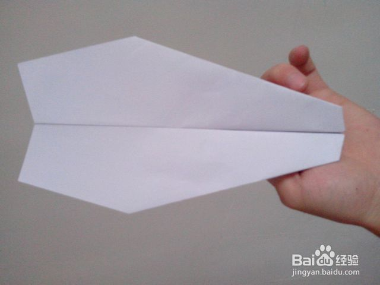

# 怎样折纸飞机飞得最远？
标签：纸飞机

> 纸飞机一个总是能勾起我们许多美好回忆的东西。

## 工具/原料
A4纸。

## 方法/步骤
1/12
叠纸飞机有很多种方法。
下面的这种，性能相对比较好。飞的既稳又远。

2/12
叠法简介：
先将A4纸竖着对折。如图：

3/12
将A4纸的一端，沿虚线折叠（两边）。

4/12
纸飞机机头怎么叠？
将折好的角翻着，注意分开的部分压在里面。

5/12
再将上端的两角沿虚线向中间对折，一定要对称。

6/12
对折完成后，剩余的尖角沿虚线翻折。然后沿中线再对折。

7/12
纸飞机翅膀怎么叠？
对折完成后，下面的两端向中间翻折。如图，沿虚线。

8/12
展开一点，如图，这就是飞机展开了双翼。

9/12
关于纸飞机的外观图片：
飞机的俯视图、前视图和后视图。

10/12
这种飞机的有效飞行里程在10m~30m，不排除特殊情况。
另外，有经验的内行，会将这种飞机做成飞去来器，使飞机在空中转圈飞行后又回到原点。

11/12
【经验大放送】：自从本篇经验发布以来，陆续接到很多网友的疑问：怎么叠纸飞机才能自己飞回来？
总共有2种方法，分别是纵向飞回和横向飞回。
第一种，【纵向飞回】，相对来说较为简单。这种在扔飞机的时候要有一点上挑的动作，飞机在飞到最高点之后，迅速地翻转180°，按照原来的轨道飞回，此时飞机的翅膀朝下。

12/12
第二种，也是最难的一种，叫【横向飞回】。此种飞机在空中盘旋一圈后返回，没有变换180°。
具体操作：将机身翅膀对折的时候，一高一矮，如下图，有一个水平差。
扔的时候，也要用上巧劲。
太硬、太沉的版纸不容易操作，风大的环境也不容易成功。
大家可以挑战一下！

